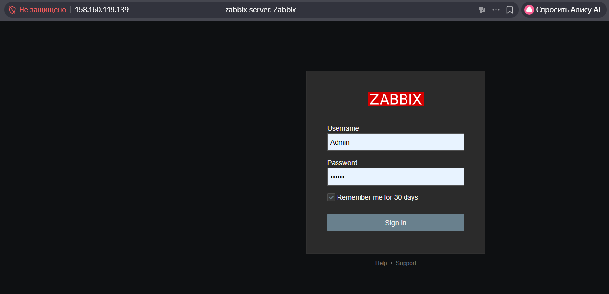
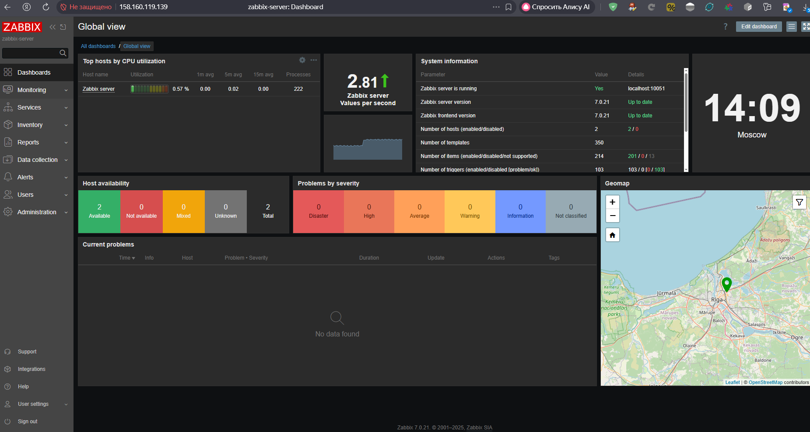
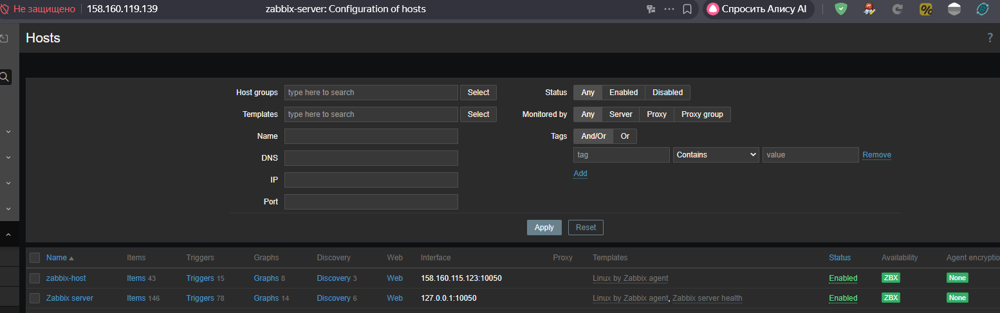
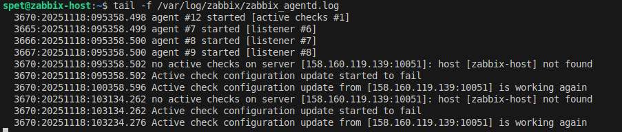
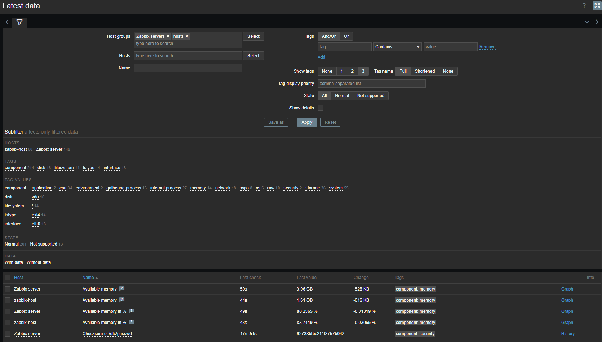
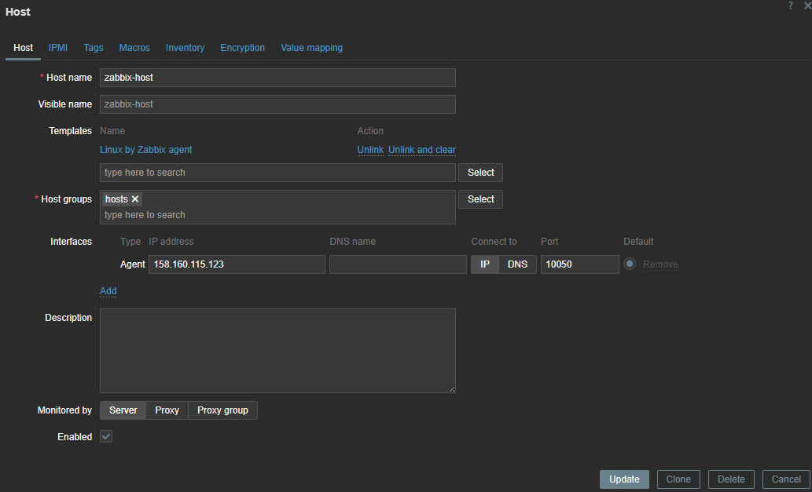

# Домашнее задание к занятию "`Система мониторинга Zabbix`" - `Спетницкий Д.И.`


---

### Задание 1

Установите Zabbix Server с веб-интерфейсом.

#### Процесс выполнения
1. Выполняя ДЗ, сверяйтесь с процессом отражённым в записи лекции.
2. Установите PostgreSQL. Для установки достаточна та версия, что есть в системном репозитороии Debian 11.
3. Пользуясь конфигуратором команд с официального сайта, составьте набор команд для установки последней версии Zabbix с поддержкой PostgreSQL и Apache.
4. Выполните все необходимые команды для установки Zabbix Server и Zabbix Web Server.

#### Требования к результатам
1. Прикрепите в файл README.md скриншот авторизации в админке.
2. Приложите в файл README.md текст использованных команд в GitHub.


---

1. Мы создали 2 машины с помощью [terraform](terraform/) и настроили их с помощью [ansible](ansible/).
2. Установили на одну машину zabbix-server, на вторую просто zabbix-agent


### Скриншоты
#### Авторизация в админке

#### Авторизовались


## Установка

```
- name: Install and Configure Zabbix Server on Ubuntu 22.04
  hosts: zabbix-server
  become: yes
  vars:
    zabbix_db_password: "123456789"
    zabbix_server_ip: "{{ hostvars['zabbix-server']['ansible_host'] | default(inventory_hostname) }}"
    postgres_user: postgres

  tasks:

    - name: Update apt cache
      apt:
        update_cache: yes
    - name: Install psycopg2 Python library for PostgreSQL interaction and acl
      apt:
        name:
            - python3-psycopg2
            - acl
        state: present

    - name: Install PostgreSQL
      apt:
        name:
          - postgresql
          - postgresql-contrib
        state: present

    - name: Start and enable PostgreSQL service
      systemd:
        name: postgresql
        state: started
        enabled: yes

    - name: Create Zabbix database user
      become_user: postgres
      postgresql_user:
        name: zabbix
        password: "{{ zabbix_db_password }}"
        role_attr_flags: LOGIN
        state: present

    - name: Create Zabbix database
      become_user: postgres
      postgresql_db:
        name: zabbix
        owner: zabbix
        state: present

    - name: Add Zabbix repository
      get_url:
        url: https://repo.zabbix.com/zabbix/7.0/ubuntu/pool/main/z/zabbix-release/zabbix-release_7.0-1+ubuntu22.04_all.deb
        dest: /tmp/zabbix-release_latest_7.0+ubuntu22.04_all.deb

    - name: Install Zabbix repository package
      apt:
        deb: /tmp/zabbix-release_latest_7.0+ubuntu22.04_all.deb
        state: present
      ignore_errors: yes

    - name: Update apt cache after adding repo
      apt:
        update_cache: yes

    - name: Install Zabbix server, frontend, agent, and Apache
      apt:
        name:
          - zabbix-server-pgsql
          - zabbix-frontend-php
          - php8.1-pgsql
          - zabbix-apache-conf
          - zabbix-sql-scripts
          - zabbix-agent
        state: present

    - name: Import initial Zabbix schema and data
      shell: zcat /usr/share/zabbix-sql-scripts/postgresql/server.sql.gz | sudo -u zabbix psql zabbix
      ignore_errors: yes

    - name: Configure Zabbix server database password
      lineinfile:
        path: /etc/zabbix/zabbix_server.conf
        regexp: "^DBPassword="
        line: "DBPassword={{ zabbix_db_password }}"
        backup: yes

    - name: Restart Zabbix server and agent services
      systemd:
        name: "{{ item }}"
        state: restarted
        enabled: yes
      loop:
        - zabbix-server
        - zabbix-agent
        - apache2

    - name: Ensure Apache is running
      systemd:
        name: apache2
        state: started
        enabled: yes

    - name: Display Zabbix web interface URL
      debug:
        msg: "Zabbix Web UI доступен по адресу: http://{{ zabbix_server_ip }}/zabbix"
```


---

### Задание 2

Установите Zabbix Agent на два хоста.

#### Процесс выполнения
1. Выполняя ДЗ, сверяйтесь с процессом отражённым в записи лекции.
2. Установите Zabbix Agent на 2 вирт.машины, одной из них может быть ваш Zabbix Server.
3. Добавьте Zabbix Server в список разрешенных серверов ваших Zabbix Agentов.
4. Добавьте Zabbix Agentов в раздел Configuration > Hosts вашего Zabbix Servera.
5. Проверьте, что в разделе Latest Data начали появляться данные с добавленных агентов.

#### Требования к результатам
1. Приложите в файл README.md скриншот раздела Configuration > Hosts, где видно, что агенты подключены к серверу
2. Приложите в файл README.md скриншот лога zabbix agent, где видно, что он работает с сервером
3. Приложите в файл README.md скриншот раздела Monitoring > Latest data для обоих хостов, где видны поступающие от агентов данные.
4. Приложите в файл README.md текст использованных команд в GitHub

---


### Скриншоты
#### 1. Hosts

#### 2. Логи агента

#### 3. Latest data

#### 4. Settings host


## Установка
```
- name: Install and Configure Zabbix Agent on Ubuntu 22.04
  hosts: zabbix-host
  become: yes
  vars:
    zabbix_server_ip: "{{ hostvars['zabbix-server']['ansible_host'] | default(inventory_hostname) }}"

  tasks:

    - name: Update apt cache
      apt:
        update_cache: yes

    - name: Add Zabbix repository
      get_url:
        url: https://repo.zabbix.com/zabbix/7.0/ubuntu/pool/main/z/zabbix-release/zabbix-release_7.0-1+ubuntu22.04_all.deb
        dest: /tmp/zabbix-release_latest_7.0+ubuntu22.04_all.deb

    - name: Install Zabbix repository package
      apt:
        deb: /tmp/zabbix-release_latest_7.0+ubuntu22.04_all.deb
        state: present

    - name: Update apt cache after adding repo
      apt:
        update_cache: yes

    - name: Install Zabbix agent
      apt:
        name: zabbix-agent
        state: present

    - name: Configure Zabbix agent (Server and ServerActive)
      lineinfile:
        path: /etc/zabbix/zabbix_agentd.conf
        regexp: "^{{ item.key }}="
        line: "{{ item.key }}={{ item.value }}"
        backup: yes
      loop:
        - { key: "Server", value: "{{ zabbix_server_ip }}" }
        - { key: "ServerActive", value: "{{ zabbix_server_ip }}" }
        - { key: "Hostname", value: "{{ inventory_hostname }}" }

    - name: Restart Zabbix agent service
      systemd:
        name: zabbix-agent
        state: restarted
        enabled: yes

    - name: Show agent configuration summary
      debug:
        msg: "Агент на {{ inventory_hostname }} настроен для подключения к серверу: {{ zabbix_server_ip }}"
```

